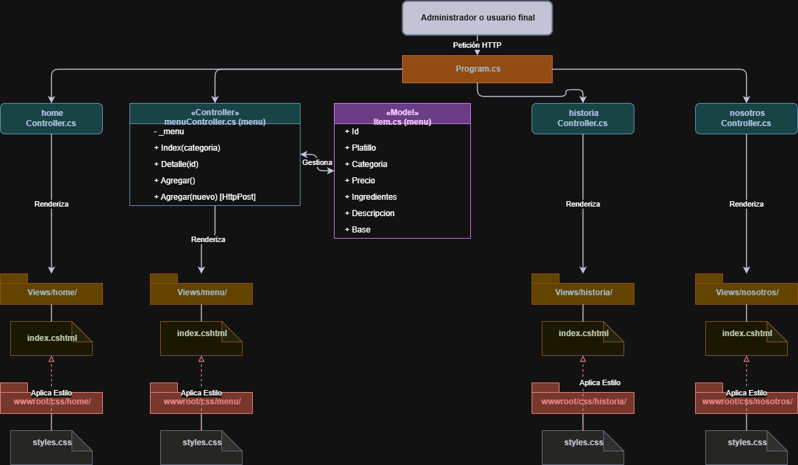

# ADR-01: Estructura base del sistema usando el patrón MVC
Campo	     Valor  
Autor	Joaquin Uriona  
Fecha	15/05/2026  
Estado `Aceptado`   
---
## Contexto

Quiero construir una aplicación web centralizada para la gestión financiera y administrativa, orientada específicamente a dueños y administradores de pequeños o medianos negocios en el cual el sistema debe permitir la visibilidad del flujo de trabajo, la gestión de catálogos de productos y la centralización de datos financieros y administrativos clave en una plataforma accesible en todo momento.  
Para el desarrollo de esta solución, se deben considerar las siguientes restricciones y objetivos:
- Restricción de Equipo: El proyecto es ejecutado por un único desarrollador, quien debe asumir la totalidad de las responsabilidades del ciclo de vida del software: desarrollo Frontend, arquitectura Backend, aseguramiento de compatibilidad tecnológica y despliegue
- Productividad y Mantenimiento: Debido a la limitación de recursos humanos, el sistema debe estructurarse de manera que el mantenimiento, la depuración y la escalabilidad inicial sean lo más sencillas y centralizadas posible, evitando la fragmentación de tecnologías.
- Reducir la Complejidad: Introducir frameworks de Frontend adicionales sin dominar alargaría el tiempo del desarrollo del proyecto por cuestiones de aprendizaje, diseñar el patrón MVC de forma pura permite concentrar el esfuerzo exclusivamente en la lógica de negocio, como se comunica y el apartado visual totalmente diseñado en C# adaptado para web.
---

## Decisión

Se decide implementar el patrón arquitectónico Model-View-Controller (MVC) utilizando el ecosistema de .NET ASP.NET Web como base para el desarrollo y despliegue de la aplicación.

### ¿Por qué?

Se eligió esta combinación tecnológica y arquitectónica por las siguientes razones de diseño y modularidad:

- Soporte Nativo para Despliegue: .NET ASP.NET provee una infraestructura robusta y optimizada que simplifica la compilación, empaquetado y puesta en producción de la aplicación web, reduciendo la carga operativa en un entorno de desarrollo unipersonal.
- Separación de Responsabilidades en Tres Capas: El patrón permite aislar el sistema en tres componentes independientes, garantizando que los cambios en uno no afecten negativamente a los demás:
- Vistas (Views): estas centralizan el apartado visual y la interfaz que consume el usuario, al estar desacopladas, permiten diseñar y modificar pantallas específicas de forma aislada, promoviendo la reutilización de componentes y evitando la duplicación de código HTML/CSS.
- Controladores (Controllers): Actúan como los intermediarios lógicos del sistema. Se encargan exclusivamente de interceptar las peticiones del usuario, procesar los flujos de información y comunicar de manera limpia las vistas con el núcleo del sistema.
- Modelos (Models): Encapsulan la lógica de negocio pura, permitiendo un desarrollo modular donde se define con total claridad qué hace el sistema, cómo procesa los datos y con qué estructuras trabaja, manteniendo el backend limpio y ordenado.

### Alternativas consideradas:

- Separar Frontend y Backend: React/Vue y una Web API 
- Microservicios: Separar la gestión de productos, finanzas y usuarios en mini-aplicaciones.
- Monolito: Meter toda la lógica y el HTML mezclado

### Alternativa	Por qué la descarté

Separar Frontend y Backend: considero que la complejidad y sobreesfuerzo seria mucha ya que no cuento con los suficientes conocimientos y estario obligario a gestionar dos proyectos totalmente independientes y por ende exige dominar JavaScript, el manejo de estados en el navegador, configuraciones de seguridad (CORS, tokens) y realizar dos despliegues distintos, para un desarrollador unipersonal, esto duplica el tiempo de desarrollo.

Arquitectura de Microservicios: requiere una infraestructura altamente compleja (orquestación de contenedores, redes internas, pasarelas de API) y una gestión DevOps avanzada, implementarlo para un MVP (Producto Mínimo Viable) diseñado por una sola persona ralentizaría el lanzamiento hasta por meses con mis conocimientos

Monolito Lineal sin Patrón: al tratarse de un sistema con datos financieros delicados, la falta de modularidad haría que un cambio estético en la pantalla pudiera romper accidentalmente un cálculo del negocio, haciendo que el mantenimiento sea peligroso y propenso a fallos críticos.

---
## Consecuencias
✅ Lo que gano:

Consecuencia Técnica: la separación en componentes (Modelos, Vistas y Controladores) agiliza drásticamente la construcción y despliegue de operaciones CRUD (Crear, Leer, Actualizar, Borrar), esenciales para la gestión de productos y finanzas. Además, permite delegar el ciclo de vida de las peticiones en la infraestructura nativa de ASP.NET, se evita la gestión manual y compleja de protocolos de red, cabeceras HTTP y estados de conexión, permitiendo un desarrollo más rápido y robusto.

Consecuencia sobre el Proceso o el Equipo: al ser el único desarrollador a cargo de la totalidad del proyecto (Frontend, Backend, DevOps, mantenimiento y gestión comercial del negocio), el orden de la arquitectura es vital, el MVC permite alternar de forma organizada entre diseñar pantallas y programar lógica de negocio, reduciendo la carga cognitiva y evitando que las múltiples responsabilidades del rol unipersonal colapsen el flujo de desarrollo.

⚠️ Lo que sacrifico o asumo:

Limitación técnica: al adoptar un enfoque MVC, la interfaz de usuario queda estrechamente acoplada al backend, por lo que si las reglas del negocio financiero crecen considerablemente en complejidad, este patrón básico corre el riesgo de saturarse y colapsar bajo el peso de controladores y modelos sobrecargados, lo cual generaría una rigidez técnica que impediría reutilizar la estructura actual si en el futuro el entorno exige escalar hacia aplicaciones móviles (iOS/Android) o de escritorio, obligándome a refactorizar todo el backend para transformarlo en una Web API independiente, además de que ante un crecimiento masivo de funciones, el sistema acumulará una deuda técnica crítica que forzaría a detener por completo el desarrollo de nuevas características con el fin de reestructurar el monolito hacia diseños más limpios y estrictamente modulares, como Clean Architecture o Arquitectura Hexagonal, que puedan soportar dicha escala de manera estable.

Deuda o riesgo: Al empaquetar todo el flujo financiero y administrativo dentro de un único bloque monolítico bajo el servidor de ASP.NET, se asume el riesgo de que si una característica específica del sistema experimenta una alta demanda de tráfico o procesamiento de datos por parte de los usuarios, se tendrá que escalar y pagar por la totalidad del servidor completo con el proveedor de hosting en lugar de poder distribuir o apagar componentes de forma aislada, lo cual incrementará los costos operativos y la complejidad del mantenimiento de la infraestructura a medida que el negocio crezca.

## Diagrama

